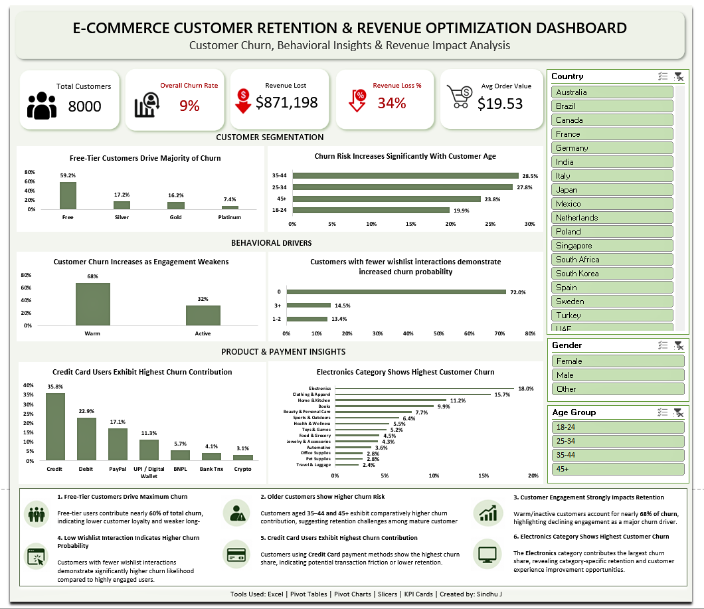

# E-Commerce Customer Retention & Revenue Optimization Dashboard

## Project Overview

This project focuses on analyzing customer churn behavior, customer engagement patterns, and revenue impact using an interactive Excel dashboard.

The dashboard was designed to help businesses identify high-risk customer segments, monitor churn trends, and support data-driven retention strategies.

---

## Business Problems Addressed

* Which customer segments contribute most to churn?
* How does customer engagement influence retention?
* Which product categories and payment methods show higher churn risk?
* What is the revenue impact caused by customer attrition?

---

## Key Insights

* Free-tier customers contributed the highest churn share
* Warm/inactive customers showed significantly higher churn probability
* Electronics category exhibited elevated customer churn
* Credit Card users showed higher churn concentration
* Customer churn resulted in substantial revenue loss

---

## Tools & Features Used

* Microsoft Excel
* Pivot Tables
* Pivot Charts
* KPI Cards
* Slicers
* Data Visualization

---

## Dashboard Preview

---

## Business Value

This dashboard helps businesses:

* Identify high-risk customer segments
* Improve customer retention strategies
* Monitor churn trends interactively
* Support data-driven decision-making
* Reduce revenue loss through customer insights
